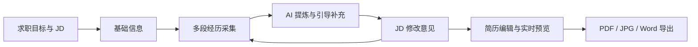
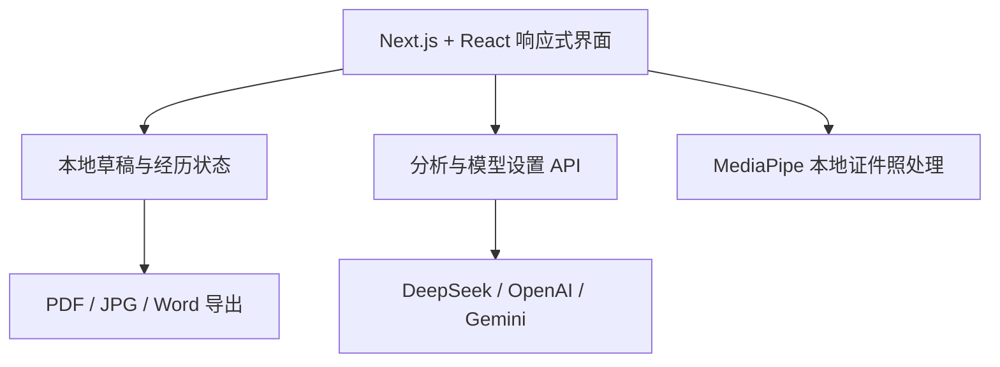

<div align="center">


# 面通 AI

### 面向低经验大学生的 AI 简历生成与岗位匹配工具

把课程项目、校园活动和零散实践，整理成有事实依据、可针对岗位调整的专业简历。

[](https://shili-ai-resume.wuy228511.chatgpt.site/)
[](#项目状态)
[](#质量与测试)

**在线地址：** [https://shili-ai-resume.wuy228511.chatgpt.site/](https://shili-ai-resume.wuy228511.chatgpt.site/)

</div>

## 产品简介

面通 AI 聚焦“没有正式实习、不会挖掘经历、不会针对 JD 改简历”的大学生用户。用户只需填写求职目标、岗位 JD 和少量真实经历，系统便会通过结构化提炼、引导追问和岗位匹配，生成可编辑、可导出的岗位定制简历。

产品坚持三项原则：

- **低输入成本**：用口语描述经历也能开始，不要求用户先学会写简历。
- **事实可追溯**：AI 只使用用户提供和确认的信息，不主动编造职责、技术、数据或成果。
- **一岗一表达**：根据目标 JD 调整经历顺序和表达重点，而不是机械堆叠关键词。

## 产品预览

### 桌面端


### 移动端

<p align="center">
  
</p>

## 核心能力

| 模块 | 能力 | 用户价值 |
| --- | --- | --- |
| 求职目标 | 输入目标岗位、公司和完整 JD | 建立岗位定制方向 |
| 经历采集 | 支持项目、实习、校园、竞赛等多段经历 | 课程和校园经验也能成为简历素材 |
| AI 提炼 | 提取事实、生成要点并动态追问 | 将口语描述转为专业表达 |
| 职责联想 | 根据经历推荐角色/职责词，点击添加、再次点击取消 | 降低关键词组织成本 |
| 修改意见 | 展示 JD 覆盖、缺失概念和补充建议 | 明确简历与岗位之间的差距 |
| 内容编辑 | 单条要点可修改、删除、补充和重新生成 | 用户始终保留最终控制权 |
| 证件照工作室 | 本地抠图并切换纯白、纯蓝背景 | 没有合适证件照也能快速处理 |
| 实时预览 | A4 ATS 单栏模板，桌面与手机响应式适配 | 边写边看最终效果 |
| 多格式导出 | PDF、JPG、可编辑 Word | 覆盖投递和后续修改场景 |
| 多模型设置 | DeepSeek、OpenAI、Gemini 切换与连接检测 | 用户可自主选择模型与 Key |

## 使用流程



1. 填写目标岗位和 JD。
2. 录入个人信息、教育背景和照片。
3. 用自己的话描述课程、项目、实习或校园经历。
4. 让 AI 提炼事实、推荐职责词并提出补充问题。
5. 根据 JD 修改意见继续完善经历。
6. 编辑最终要点并导出简历。

## 与普通简历生成器的区别

| 普通模板工具 | 面通 AI |
| --- | --- |
| 要求用户已经知道写什么 | 先帮助用户发现哪些经历值得写 |
| 一次生成整份内容 | 按经历持续补充并允许逐条修改 |
| 主要关注排版 | 同时关注事实、表达与岗位匹配 |
| 关键词字面命中 | 逐步升级为有证据的语义概念匹配 |
| AI 输出即最终内容 | 用户确认、编辑和锁定内容优先 |

## 技术架构



- **前端**：Next.js App Router、React 19、TypeScript、CSS。
- **部署**：vinext、Cloudflare Workers、Sites。
- **AI**：DeepSeek、OpenAI、Gemini，统一结构化输出接口。
- **本地能力**：浏览器草稿保存、MediaPipe Image Segmenter。
- **质量保障**：Node.js 原生测试、生产构建验证和密钥扫描。

## 本地运行

环境要求：Node.js `>=22.13.0`。

```bash
npm install
npm run dev
```

执行生产构建和测试：

```bash
npm run build
node --test tests/rendered-html.test.mjs
```

打开页面后，可在“模型设置”中录入并检测自己的 API Key。请勿将真实 Key 写入代码、截图、日志或 Git 提交。

## 模型配置

系统目前支持：

- DeepSeek
- OpenAI
- Gemini

网页基础界面可以直接体验；调用真实模型时，需要在网站的“模型设置”中配置对应服务商的 API Key。Key 不会以完整明文回显在页面中。

## 数据与隐私

- 简历草稿主要保存在当前浏览器本地。
- 模型 Key 通过安全 Cookie 传递，页面仅展示连接状态。
- 证件照抠图在当前设备完成，原始照片不会保存到项目仓库。
- 仓库中的 `.env.example` 只包含变量名称，不包含真实 Key。
- 正式商业化前仍需补充隐私政策、数据删除说明和更完整的访问控制。

## 质量与测试

当前自动化检查覆盖：

- 产品首页服务端渲染。
- 经历分析接口与空输入校验。
- 三种模型服务商状态隔离。
- 模型 Key 的保存、清除与不回显。
- 草稿、打印和模型切换逻辑。
- AI 职责词的添加与再次点击取消。

当前结果：**生产构建通过，7 项自动化测试通过。**

## 项目文档

- [产品需求文档 PRD](./docs/PRD.md)
- [AI Prompt 与结构化输出规范](./docs/PROMPT.md)
- [长期产品路线图](./ROADMAP.md)

## 后续路线

### 二期：让简历可以长期使用

- 经历资产库：经历只填写一次，后续反复调用和补充。
- 一岗一简历：根据不同 JD 选择经历并生成岗位版本。
- 云端保存与历史版本：支持登录、恢复和跨设备使用。
- 稳定评分：JD 概念分母固定，分数变化可以解释。
- 非破坏式生成：用户修改内容不再被后续生成覆盖。

### 后续方向

- JD 能力拆解与证据映射。
- 面试问题预测与回答素材整理。
- 求职进度和投递版本管理。
- 小程序与移动端能力复用。

完整规划见 [ROADMAP.md](./ROADMAP.md)。

## 项目状态

当前版本已完成从经历采集、AI 提炼、JD 修改意见到 A4 简历生成与多格式导出的 MVP 闭环，适合产品演示和小范围用户测试。

现阶段仍在持续完善语义匹配、内容去重、数据持久化和导出视觉回归，不将“匹配分数更高”作为唯一目标，而是同时关注事实完整度和用户最终保留率。

---

<div align="center">

如果这个项目对你有帮助，欢迎 Star、提交 Issue，或分享你的使用反馈。

</div>
